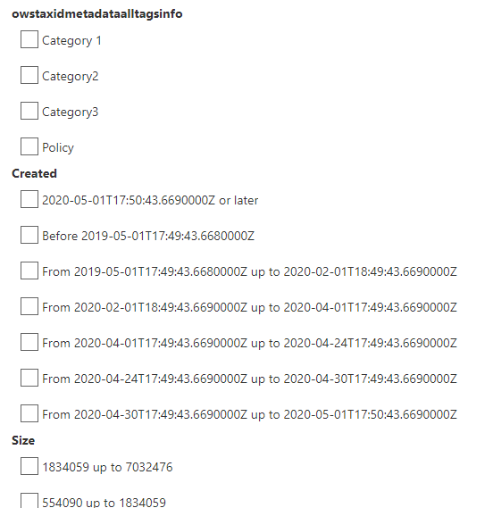
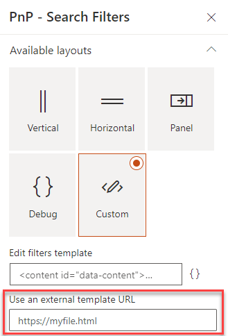

The 'custom' layout is the minimal layout to start with if you want to create your own customized UI from scratch. You can also start from an existing layout.

{: .center}

> Updating a builtin layout (ex: 'Horizontal', 'Vertical', etc.) will automatically switch the selected layout to 'Custom' with your modifications as content. **All previous custom layout content will be overwritten**.

{: .center} 

You have also the ability to use an external _.html_ file to centralize your customizations. This file must be stored in an accessible location for uses (ex: a SharePoint document library with _'Read'_ permissions for concerned users).

{: .center} 

> Unless you specify an external file, the template content is stored in the Web Part property bag.

Updating the layout HTML template is a good option for minor UI updates (Ex: add a link, update colors, etc.). For more control over the UI, you may want to use the extensibility library feature.