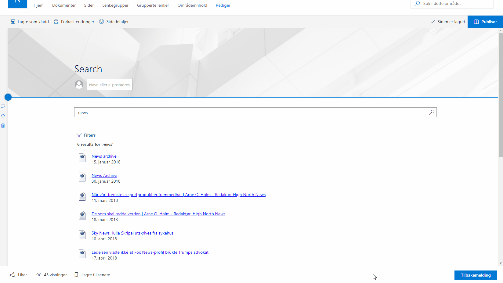
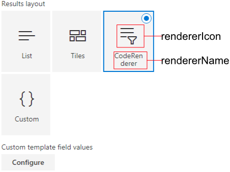
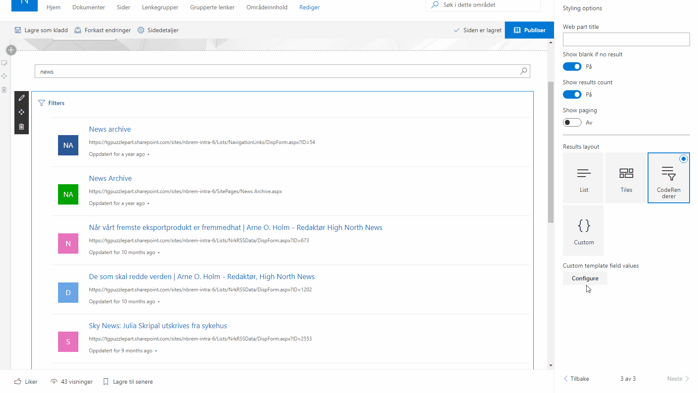

# Custom Renderer - v3
[Table of contents](../index.md)
## Summary

This sample is an example on how to use custom code renderers in the react-search-refiners project. Custom code renderers lets you render the search results from a react-search-refiners webpart in your own way, with whatever tools you prefer.
Typically, you will use SPFx Application Customizers to mount these renderers, but you may also use SPFx webparts. This sample contains a SPFx Application Customizer which uses React and Office-UI-Fabric-React to render the search results.
This package contains two separate renderers: a basic renderer and a persona renderer for rendering searches after people.

## Used SharePoint Framework Version ##

## Applies to
* [SharePoint Framework](https:/dev.office.com/sharepoint)
* [Office 365 tenant](https://dev.office.com/sharepoint/docs/spfx/set-up-your-development-environment)
* [React Search Refiners](https://github.com/microsoft-search/pnp-modern-search/tree/main/search-custom-renderer)

## Solution
Solution|Author(s)
--------|---------
react-search-refiners-renderers | Tarald Gåsbakk - [@taraldga](http://www.twitter.com/taraldgasbakk)

## Version history
Version|Date|Comments
-------|----|--------
1.0.0 | Jan 06, 2019 | Initial release
1.0.0 | Mar 05, 2019 | Added Persona renderer
1.0.1 | Mar 16, 2019 | Fixed hardcoded profile image url in Persona renderer. Updated some files to be in sync with Search solution

## Minimal Path to Awesome

- Follow the Minimal Path to Awesome for [React Search Refiners](https://github.com/microsoft-search/pnp-modern-search/tree/main/search-custom-renderer).
- In this repository, run from the command line:
    - `npm install`
    - `gulp serve`

## Creating your own renderers
The renderer bundled in this sample is a simple renderer designed to show how a simple implementation of a code renderer would look like. Following is a quick tour of the setup-process and the different settings you will encounter when creating your own renderer.

## Registering a new renderer

The renderers work by announcing themselves to any react-search-refiners webparts that exists on the pages they are installed on. The registration process is handled by the 'registerRenderer'- function in the 'ResultService' - class in './src/services'. A typical registration will take place onInit.

The parameters of the registerRenderer function:

 - **rendererId**: The id of the current renderer. Used to identify which renderer the user has selected. Typically 'this.componentId'.
 - **rendererName**: The displayName of the renderer in the react-search-refiners webpart property panel.
 - **rendererIcon**: The office-ui-fabric-react icon that should be displayed in the property pane of the webpart.
 - **callback**:  The callback function that is used to render the webpart. This will be called when the renderer is selected and new data is available.
 - **customFields**: Optional names of custom fields that may be used for templating in the renderer.

### Templating
By registering a field-name in the 'customFields' value, you may expose them to the user, letting them choose which fields should be displayed in different places in your renderer. In the bundled example, a subheader is passed along as a template field. The dropdown selection that the user can chose elements from are the elements selected for fetching by the search webpart.

## Using the Persona renderer
In order to make the persona-renderer work as is when installing the ready-made package, you need to fetch the following properties:
PreferredName,WorkEmail,WorkPhone,JobTitle,OfficeNumber,Title,PictureURL,FirstName,LastName,userName,Path
