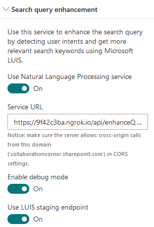
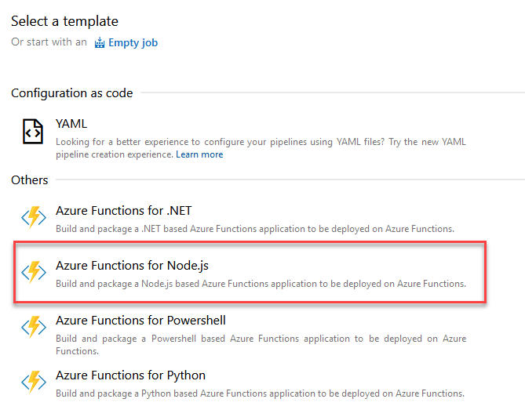
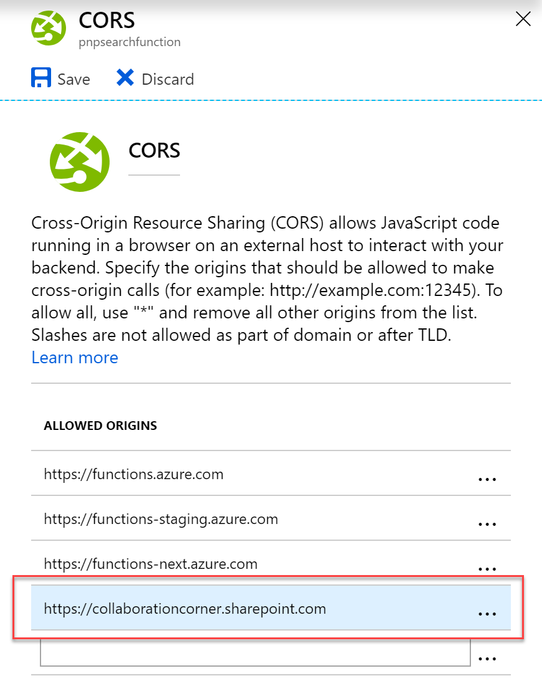

# Search Query Enhancer - Debug locally - v3
[Table of contents](../index.md)
### Prerequisites

- In VSCode, open the root folder `./functions`.
- Install all dependencies using `npm i`.
- Install [Azure CLI](https://docs.microsoft.com/en-us/cli/azure/install-azure-cli-windows?view=azure-cli-latest) on youre machine.
- Install Azure Function Core tools globaly using `npm i -g azure-functions-core-tools@2.7.1149` (version 2).
- In a Node.js console, build the solution using `npm run build:dev` cmd. For production use, execute `npm run build` (minified version of the JS code).
- In a Node.js console, from the `functions/dist` folder, run the following command `func start`.
- In VSCode, launch the *'Debug Local Azure Function'* debug configuration
- Set breakpoints directly in your **'.ts'** files
- Send your requests either using Postman with the localhost address according to your settings (i.e. `http://localhost:7071/api/enhanceQuery`) or directly in the 'Search Box Webpart' via the 'Service URL' parameter. For the last scenario  you can use `npm i -g ngrok` to redirect calls to your localhost function using the following command `ngrok http 7071`.

    

    

### Azure Function Proxy configuration

This solution uses an Azure function proxy to get an only single endpoint URL for multiple functions. See the **proxies.json** file to see defined routes.

## How to deploy the solution to Azure ? ##

### Development scenario

We recommend to use Visual Studio Code to work with this solution.

- In VSCode, download the [Azure Function](https://code.visualstudio.com/tutorials/functions-extension/getting-started) extension
- Sign-in to to Azure account into the extension
- In a Node.js console, build the application using the command `npm run build` (minified version)
- Use the **"Deploy to Function App"** feature (in the extension top bar) using the *'dist'* folder. Make sure you've run the `npm run build` cmd before.
- Upload the application settings (`local.settings.json`)

### Production scenario with CI

A `deploy.ps1` script is available to also deploy this function into your Azure environment.

- From you Azure portal, create a new empty function
- Set the `Azure_Function_Name` value in the `local.settings.json` accordingly.
- Login to Azure using `az login` then run `deploy.ps1` script with your parameters.

OR

- If you use Azure DevOps, you can simply use the default build template and release task for Azure Functions ommiting this script.

_Build template_

_Release task_

***In both scenarios, you can test your function using Postman. If you test it using a SPFx component, don't forget to add the SharePoint domain to the CORS settings to allow this origin:***

